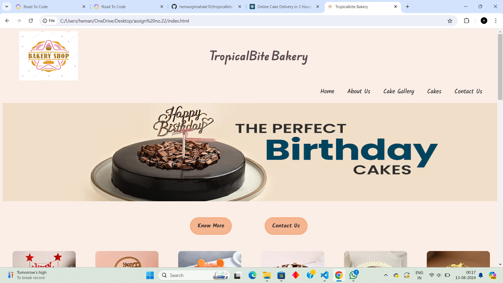
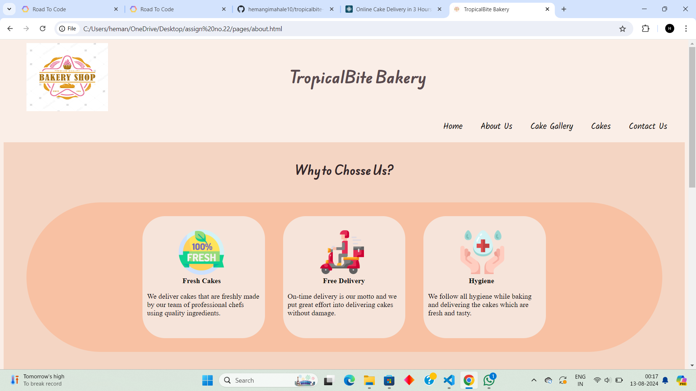
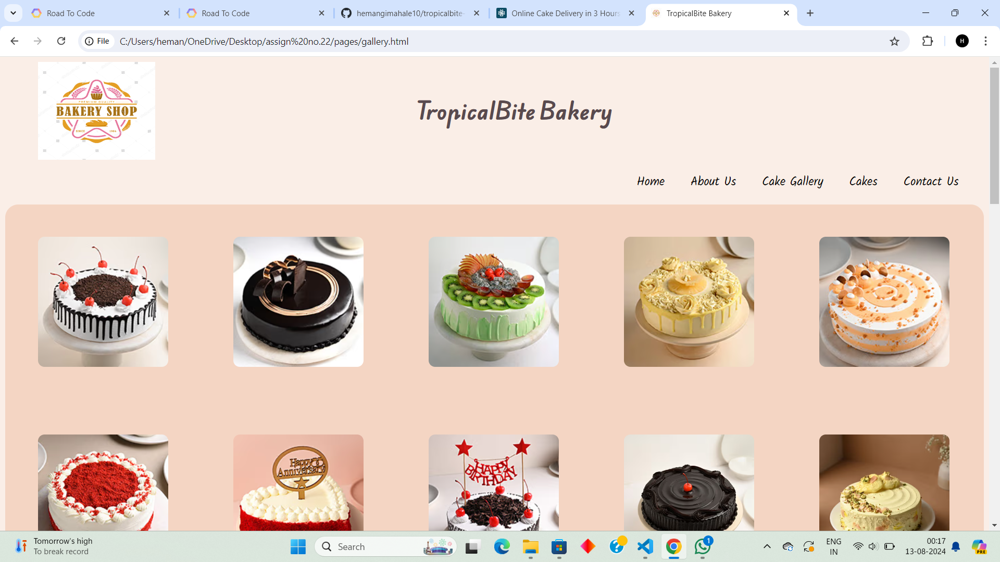
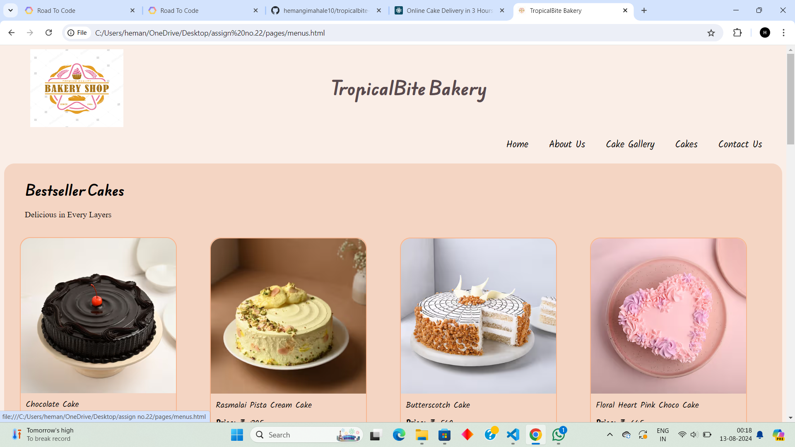
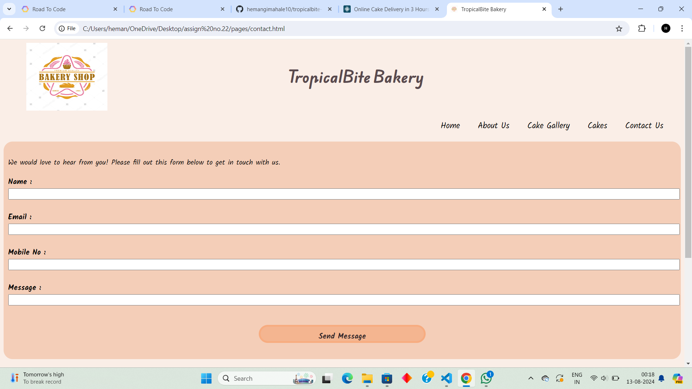

# TropicalBite Bakery

Welcome to *TropicalBite Bakery !*

This is open-source *dummy project i.e (just for practice)*
information about cakes like
home ,contact and many more etc.

Website URL : [visit our website](https://tropicalbite-bakery.netlify.app/)

We have various pages in this websites are as follows :

- *Home*
- *About Us*
- *Cake Gallery*
- *Cakes*
- *Contact Us*

## *Home Page*

## Information About Home Page

- *Page Link* : [Visit Home Page](https://tropicalbite-bakery.netlify.app/).
- *Summery Of Page* : This is a Home Page. This is a main entry page of our website.
  This page contains information about cakes and its types.
- *Language Used* : HTML 5 ,css.

## *About Page*

## Information about About Page

- *Page Link* : [Visit About Page](https://tropicalbite-bakery.netlify.app/pages/about) .
- *Summery Of Page* : This is About Page. This page contains information about bakery. In this page,some points are given to choose our bakery.
- *Language Used* : HTML 5,css

## *Cake Gallery Page*

## Information about Cake Gallery Page

- *Page Link* : [Visit Cake Gallery Page](https://tropicalbite-bakery.netlify.app/pages/gallery) .
- *Summery Of Page* : This is an Cake Gallery Page. This page contains images of cakes which are available and designed/baked in bakery.
- *Language Used* : HTML 5 ,css

## *Cakes Page*

## Information about Cake Menu Page

- *Page Link* : [Visit Cake Menu Page](https://tropicalbite-bakery.netlify.app/pages/menus) .
- *Summery Of Page* : This is an Cake Menu Page. This page contains carts of cake with price. In this page, best selling cakes and premium cakes are also given. 
- *Language Used* : HTML 5 ,css

## *Contact Us Page*

## Information about Contact Page

- *Page Link* : [Visit Contact Page](https://tropicalbite-bakery.netlify.app/pages/contact) .
- *Summery Of Page* : This is an Contact Page. This page contains form by which customer can connect to us and share his/her response.
- *Language Used* : HTML 5 ,css